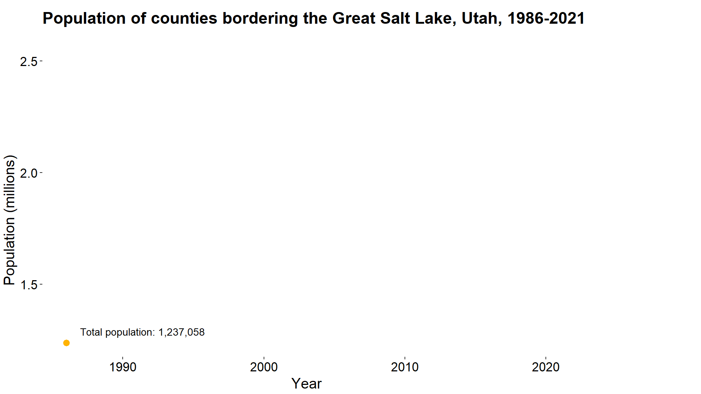
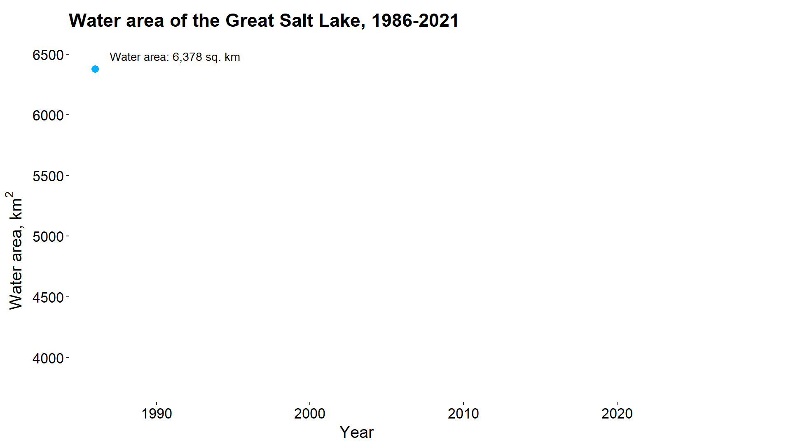
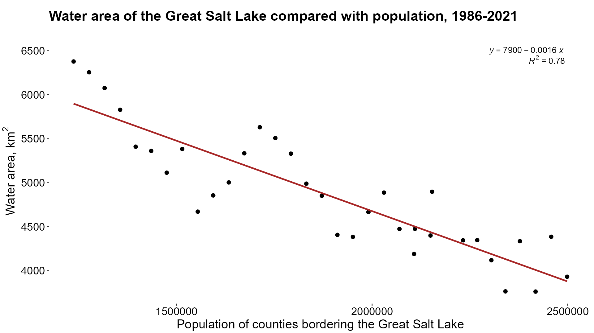

```{r}
library(dplyr) 
library(ggplot2) 
library(gganimate) 
library(stringr) 
library(ggpubr)
```

This document handles the charts used in the original presentation. First, it reads data created in the previous script:

```{r}
vars_joined <- readr::read_csv("../data/vars_joined.csv") 
vars_joined.playa <- vars_joined %>% 
  mutate(new_playa = lag(area_km)-area_km)
```

It creates some labels, in a very inefficient manner -- if I were to rewrite this code today, I'd use something like `format(x, big.mark = ",")`.

```{r}
vars_joined.label <- vars_joined.playa %>%
  mutate(tpop_lab = paste0("Total population: ", str_sub(tpop, 1,1), ",", str_sub(tpop, 2,4), ",", str_sub(tpop, 5,7)), 
         area_lab = paste0("Water area: ", str_sub(round(area_km), 1,1), ",", str_sub(round(area_km), 2,4), " sq. km"), 
         playa_lab = paste0("New playa area: ", round(new_playa), " sq. km"))
```

First, we set up an empty set of axes on which we'll plot our data:

```{r fig.width = 10, fig.dpi = 300, fig.asp=.5}
p1 <- ggplot(data = vars_joined, aes(x = year, y = tpop_mn))+ 
  labs(title = "Population of counties bordering the Great Salt Lake, Utah, 1986-2021",
       x = "Year", y = "Population (millions)")+
  theme(panel.background = element_blank(),
        axis.title.x = element_text(size = 16), 
        axis.title.y = element_text(size = 16, hjust = 0.4, vjust = 1), 
        axis.text.x = element_text(color = "black", size = 14), 
        axis.text.y = element_text(color = "black", size = 14), 
        plot.title = element_text(hjust = 0, vjust = 5, size = 18, face = "bold"), 
        legend.key = element_blank(), 
        legend.position = "top", 
        plot.margin = margin(1, 5, 0.1,0.1, 'cm')) 

p1
```

Then, we'll use those axes to create an animated chart showing change in population over time.

```{r eval=FALSE}
p2 <- p1 + 
  geom_point(data = vars_joined.label, aes(x = year, y = tpop_mn), color = "#ffb303", size = 3)+ 
  geom_line(data = vars_joined.label, aes(x = year, y = tpop_mn), color = "#ffb303", size = 1)+ 
  geom_text(data = vars_joined.label, aes(x = year + .1, y = tpop_mn), 
            label = vars_joined.label$tpop_lab, 
            hjust = -0.1, 
            vjust = -1, 
            size = 4, 
            show.legend = FALSE)+
  transition_reveal(year)+ 
  ease_aes('linear')+ 
  coord_cartesian(clip = 'off') 

animate(p2, start_pause = 24, end_pause = 24)
```



Just like before, we'll create an empty set of axes, this time for water area:

```{r fig.width = 10, fig.dpi = 300, fig.asp=.5}
p3 <- ggplot(data = vars_joined, aes(x = year, y = area_km))+
  labs(title = "Water area of the Great Salt Lake, 1986-2021", x = "Year", y = "Water area,"~km^2)+
  theme(panel.background = element_blank(), 
        axis.title.x = element_text(size = 16), 
        axis.title.y = element_text(size = 16, hjust = 0.4, vjust = 1), 
        axis.text.x = element_text(color = "black", size = 14), 
        axis.text.y = element_text(color = "black", size = 14), 
        plot.title = element_text(hjust = 0, vjust = 5, size = 18, face = "bold"), 
        legend.key = element_blank(), 
        legend.position = "top", 
        plot.margin = margin(1, 5, 0.1,0.1, 'cm')) 

p3

```

And, again like before, we'll animate over those axes.

```{r eval=FALSE}
p4 <- p3 + 
  geom_point(data = vars_joined, aes(x = year, y = area_km), color = "#03afff", size = 3)+ 
  geom_line(data = vars_joined, aes(x = year, y = area_km), color = "#03afff", size = 1)+ 
  geom_text(data = vars_joined.label, aes(x = year + .1, y = area_km), 
            label = vars_joined.label$area_lab, 
            hjust = -0.1, 
            vjust = -1, 
            size = 4, 
            show.legend = FALSE)+
  transition_reveal(year)+
  ease_aes('linear')+
  transition_reveal(year)+
  coord_cartesian(clip = 'off')

animate(p4, start_pause = 24, end_pause = 24)

if (!file.exists("../images/utah_gsl_area.gif")){
  anim_save(filename = "../images/utah_gsl_area.gif", 
            fps = 24, nframes = 207, 
            animation = p4, 
            start_pause = 24, 
            end_pause = 24, 
            height = 1080, 
            width = 1920, 
            res = 180, 
            renderer = gifski_renderer())
}
```



```{r echo=FALSE, eval=FALSE}
p5 <- ggplot(data = vars_joined.label, aes(x = tpop, y = area_km))+ 
  labs(title = "Water area of the Great Salt Lake compared with population, 1986-2021", x = "Population of counties bordering the Great Salt Lake", y = "Water area,"~km^2)+
  theme(panel.background = element_blank(), 
        axis.title.x = element_text(size = 16), 
        axis.title.y = element_text(size = 16, hjust = 0.5, vjust = 1), 
        axis.text.x = element_text(color = "black", size = 14), 
        axis.text.y = element_text(color = "black", size = 14), 
        plot.title = element_text(hjust = 0, vjust = 5, size = 18, face = "bold"), 
        legend.key = element_blank(), 
        legend.position = "top", 
        plot.margin = margin(1, 5, 0.1,0.1, 'cm')) 

p5
```

```{r echo=FALSE, eval=FALSE}
p6 <- p5 +
  geom_point(data = vars_joined, aes(x = tpop, y = area_km), color = "#9B9A76", size = 3)+
  geom_line(data = vars_joined, aes(x = tpop, y = area_km), color = "#9B9A76", size = 1)+
  geom_text(data = vars_joined.label,
  aes(x = tpop + 10000,
  y = area_km),
  label = paste0(vars_joined.label$tpop_lab, "\n", vars_joined.label$area_lab),
  hjust = -0.1, vjust = -1, size = 4, show.legend = FALSE) +
  transition_reveal(tpop)+
  ease_aes('linear')+
  coord_cartesian(clip = 'off')

animate(p6, start_pause = 24, end_pause = 24, width = 8, height = 4, units = "in", dpi = 300)
```
One last time, this time creating a linear regression model:
```{r fig.width = 11, fig.dpi = 300, fig.asp=.5}
p8 <- ggplot(data = vars_joined.label, aes(x = tpop, y = area_km))+ 
  labs(title = "Water area of the Great Salt Lake compared with population, 1986-2021", x = "Population of counties bordering the Great Salt Lake", y = "Water area,"~km^2)+ 
  theme(panel.background = element_blank(), 
        axis.title.x = element_text(size = 16), 
        axis.title.y = element_text(size = 16, hjust = 0.5, vjust = 1), 
        axis.text.x = element_text(color = "black", size = 14), 
        axis.text.y = element_text(color = "black", size = 14), 
        plot.title = element_text(hjust = 0, vjust = 5, size = 18, face = "bold"), 
        legend.key = element_blank(), 
        legend.position = "top", 
        plot.margin = margin(1, 0.1, 0.1,0.1, 'cm')) 

p8
```

```{r eval=FALSE}
p7 <- p8+ geom_point(data = vars_joined, aes(x = tpop, y = area_km), color = "black", size = 2)+ 
  geom_smooth(method=lm, se = FALSE, color = "#a82727")+ 
  stat_regline_equation(label.x = 2300000, label.y = 6500, aes(label = ..eq.label..))+ 
  stat_regline_equation(label.x = 2400000, label.y = 6400, aes(label = ..rr.label..)) 

p7

if (!file.exists("../images/pop_vs_area.png")){
  ggsave(p7, filename = "../images/pop_vs_area.png", width = 1920, height = 1080, dpi = 180, units = 'px')
}
```



```{r}
linreg <- lm(area_km ~ tpop, data = vars_joined)

summary(linreg)
```


